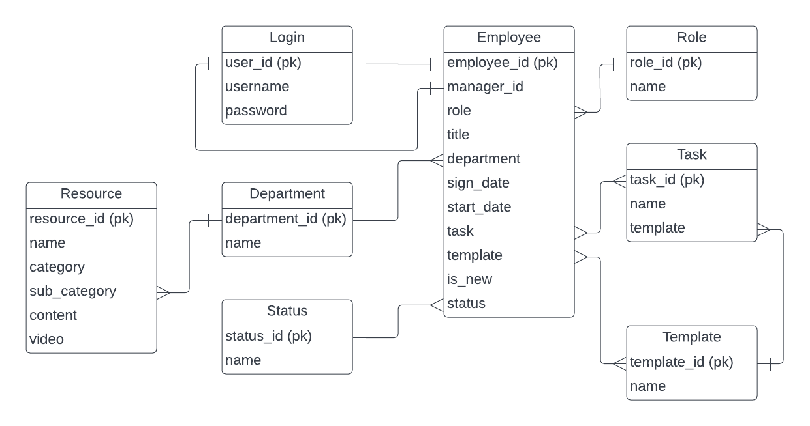

# Employee Orientation Web

#### Video Demo: [URL here]()

#### Description:

**Idea**
Employee Orientation is an indispensable procedure for every business. Importantly, the first impression the company makes on the first day of a new hire's job can make or break their level of commitment.

With this Employee Orientation software, the induction of an employee becomes easy and fast for HR team and managers. They can easily provide all essential information for new hires.

**Distinctiveness and Complexity**
This is a project built with Django framework for backend, and Javascript, Bootstrap for frontend. It contains 3 apps.

1. authentication: application for register new employees, login and logout

2. hr: application for HR team to view newhire list, modify employees'profile, update each employee orientation status, follow todo checklist, add new resources for newhire

3. resources: application specially for new hires at the company, including 4 main categories: company, handbook, trainings, and first contacts

Here is a database diagram

For the scope of this project, a superuser (admin) have inserted data into certain tables (Role, Department, Status, Login of current employees, Template, Task). When users log in, depending on their roles, views will render access to different pages, and limit some functions.For admin, manager, HR role, they can access to both Newlyhire List and Resources page. For employee role, they can only view Resources page.

* Newlyhire List page (for admin, manager, HR role)
    * This list is ordered by employee's start date, and only shows employees whose orientation status is "upcoming" or "current".
    * The Add Newhire button will help user to register new employees with their usernames, passwords, and roles
    * At this page, users can modify the orientation status by clicking at the select button, which is run by Javascript
    * The View button will lead users to View Profile page

* Register
    * when form is valid, username and password will be saved into Login table
    * role will be checked to decide if new employee is_staff or is_admin or none, then Login table will be updated
    * new employee will also be saved into Employee table

* View Profile page
    * At the registration step, there are only username and role are saved into Employee table, therefore this page will help HR team to update employee's profile by filling the form, including title, department, manager, sign_date, start date, and templates.
    * Manager field is a list of employees having manager role
    * Sign_date and Start date are wrappers around 3 select widgets: one each for month, day, and year.
    * Template contains all available task templates to choose. User can click Control or Command to choose multiple templates.
    * When user clicks Save button, a message is shown to inform the profile is successfully modified, and all according tasks will be displayed by template category.
    * When user clicks on a finish task, the task will be disappear (using Javascript)

* Resources page (for all users)
    * But the button Add Resource only shown to admin, HR, and manager
    * 4 categories are shown: company, handbook, trainings, first contacts
    * Company and Handbook contains neccessary informations for newhire. When clicking at these categories, user will see a list of interesting subjects whose content will be shown or disappeared when clicked (using Javascript)
    * First contacts show all user's team members who are at the same departement.
    * Trainings are embedded YouTube videos which is customized by user's departement. So don't be surprised if there are no training videos for certain departments.

* Add Resource (form)
    * To add resource for Company and Handbook category, user has to fill in (resource) name, category, and content
    * To embed a video for Trainings category, user has to fill (resource) name, category, sub_category (choose a target department for this video), video (url)

